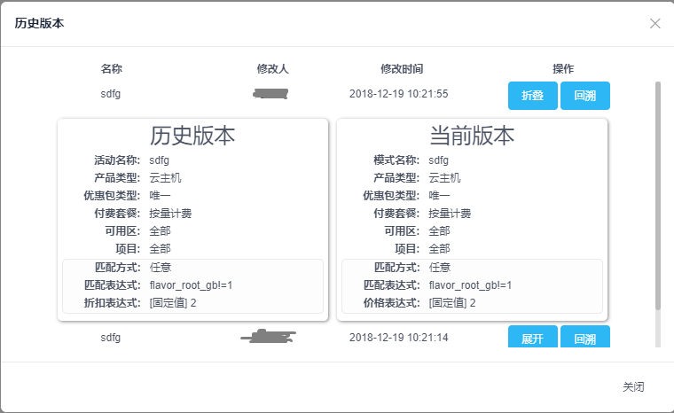
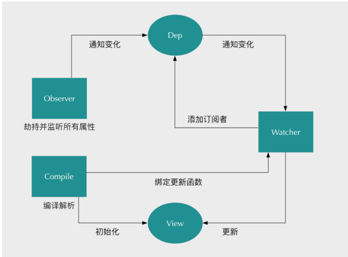

# VUE 数据绑定初探
## 背景
项目中遇到一个需求是需要渲染一个列表，然后点击每一行展开按钮，显示该行一个详情

初步实现想法是在拿到列表数据时，给每一项添加属性show,初始值为false,点击按钮将show改为!show，从而控制详情显示隐藏
但发现不生效，详情没有按照预期显示
探究其原因是因为数据的改变没有引起界面的重新渲染
那么数据是怎么引发界面重新渲染的呢？什么样的数据改变才会引起界面重新渲染呢？

## 原理

VUE 在进行数据双向绑定时，主要用到了两个思想：数据劫持和订阅发布模式

### 数据劫持

vue 在拿到export default 的data中声明的变量后，会进行跟踪处理，
这个跟踪处理主要就是将变量的赋值和读取,参照对象属性的setter和getter进行使用Object.defineProperty重写成响应对象
即读取一个变量的数据时会通过调用getter方法return获取值，
重新赋值时会通过setter方法判断新值旧值是否相同，不同则进行更新，从而调用更新函数，进行视图更新

```
/**
 * Define a reactive property on an Object.
 */
export function defineReactive (
  obj: Object,
  key: string,
  val: any,
  customSetter?: ?Function,
  shallow?: boolean
) {
  const dep = new Dep()

  const property = Object.getOwnPropertyDescriptor(obj, key)
  if (property && property.configurable === false) {
    return
  }

  // cater for pre-defined getter/setters
  const getter = property && property.get
  if (!getter && arguments.length === 2) {
    val = obj[key]
  }
  const setter = property && property.set

  let childOb = !shallow && observe(val)
  Object.defineProperty(obj, key, {
    enumerable: true,
    configurable: true,
    /******/
    get: function reactiveGetter () {
      const value = getter ? getter.call(obj) : val
      if (Dep.target) { 
        dep.depend()//获取这个值时，即将获取的这个地方当作订阅者放到订阅者列表中
        if (childOb) {
          childOb.dep.depend()
          if (Array.isArray(value)) {
            dependArray(value)
          }
        }
      }
      return value
    },
    /******/
    /******/
    set: function reactiveSetter (newVal) {
      const value = getter ? getter.call(obj) : val
      /* eslint-disable no-self-compare */
      if (newVal === value || (newVal !== newVal && value !== value)) { //与旧值相同，直接return 不更新
        return
      }
      /* eslint-enable no-self-compare */
      if (process.env.NODE_ENV !== 'production' && customSetter) {
        customSetter()
      }
      if (setter) {
        setter.call(obj, newVal)
      } else {
        val = newVal //与旧值不同，重新赋值
      }
      childOb = !shallow && observe(newVal)
      dep.notify() //通知更新
    }
    /******/
  })
}
```

### 订阅发布模式

进行视图更新时,更新函数需要知道视图哪些地方需要更新，以及由于该变量发生变化可能引起的其他变量变化或者触发一定的功能函数，
所以我们需要对数据的变化进行监听，并告知用到变量的地方（即订阅者），变量发生了变化，需要执行依据此变化要做的事
因为订阅者很可能不止一个（即一个变量被多处用到,包括js和html模板）,所以我们需要一个地方存放订阅者，并批量通知订阅者进行更新

```
mport type Watcher from './watcher' //或初始化watcher
import { remove } from '../util/index'

let uid = 0

/**
 * A dep is an observable that can have multiple
 * directives subscribing to it.
 */
export default class Dep {
  static target: ?Watcher;
  id: number;
  subs: Array<Watcher>;

  constructor () {
    this.id = uid++
    this.subs = [] //订阅者集合
  }

  addSub (sub: Watcher) {  //添加订阅者集合
    this.subs.push(sub)
  }

  removeSub (sub: Watcher) {
    remove(this.subs, sub)
  }

  depend () {
    if (Dep.target) {
      Dep.target.addDep(this)
    }
  }

  notify () { //批量更新
    // stabilize the subscriber list first
    const subs = this.subs.slice()
    for (let i = 0, l = subs.length; i < l; i++) {
      subs[i].update()
    }
  }
}

// the current target watcher being evaluated.
// this is globally unique because there could be only one
// watcher being evaluated at any time.
Dep.target = null
const targetStack = []

export function pushTarget (_target: ?Watcher) {
  if (Dep.target) targetStack.push(Dep.target)
  Dep.target = _target  //将watcher缓存到Dep.target
}

export function popTarget () {
  Dep.target = targetStack.pop()
}
```

定义订阅者，订阅者需要自己将自己放到变量的订阅者列表中，采用的方法是将自己暂存在Dep.target上，
在初始化的时候调用一下变量，利用变量getter方法，将自己添加到订阅者列表，然后将Dep.target至空，取消暂存
```
export default class Watcher {
  vm: Component;
  expression: string;
  cb: Function;
  id: number;
  deep: boolean;
  user: boolean;
  lazy: boolean;
  sync: boolean;
  dirty: boolean;
  active: boolean;
  deps: Array<Dep>;
  newDeps: Array<Dep>;
  depIds: SimpleSet;
  newDepIds: SimpleSet;
  getter: Function;
  value: any;

  constructor (
    vm: Component,
    expOrFn: string | Function,
    cb: Function,
    options?: ?Object,
    isRenderWatcher?: boolean
  ) {
    this.value = this.lazy
      ? undefined
      : this.get() //将watcher 自己装进变量的订阅者列表
  }

  /**
   * Evaluate the getter, and re-collect dependencies.
   */
  get () {
    pushTarget(this) //暂存到Dep.target
    let value
    const vm = this.vm
    try {
      value = this.getter.call(vm, vm) //调用变量的getter函数，将自己装到订阅者列表
    } catch (e) {
      if (this.user) {
        handleError(e, vm, `getter for watcher "${this.expression}"`)
      } else {
        throw e
      }
    } finally {
      // "touch" every property so they are all tracked as
      // dependencies for deep watching
      if (this.deep) {
        traverse(value)
      }
      popTarget()//取消watcher暂存，释放该watcher的绑定
      this.cleanupDeps()
    }
    return value
  }

  
  /**
   * Subscriber interface.
   * Will be called when a dependency changes.
   */
  update () { //dep批量更新调用
    /* istanbul ignore else */
    if (this.lazy) {
      this.dirty = true
    } else if (this.sync) {
      this.run()
    } else {
      queueWatcher(this)
    }
  }

  /**
   * Scheduler job interface.
   * Will be called by the scheduler.
   */
  run () {
    if (this.active) {
      const value = this.get()
      if (
        value !== this.value ||
        // Deep watchers and watchers on Object/Arrays should fire even
        // when the value is the same, because the value may
        // have mutated.
        isObject(value) ||
        this.deep
      ) {
        // set new value
        const oldValue = this.value
        this.value = value
        if (this.user) {
          try {
            this.cb.call(this.vm, value, oldValue) //执行更新回调
          } catch (e) {
            handleError(e, this.vm, `callback for watcher "${this.expression}"`)
          }
        } else {
          this.cb.call(this.vm, value, oldValue) //执行更新回调
        }
      }
    }
  }
}
```

### 解析模板

在解析模板时遇到指令或者&#123;&#123;&#125;&#125;时，将变量值替换到dom节点中，然后生成一个订阅者(根据参数将自己添加到对应绑定变量的订阅者列表中)，将自己的更新订阅到变量的变化中，从而在变量变化时，更新视图，
每解析到一个地方用到同一个变量，就生成一个watcher,从而反应出需要使用订阅者列表进行批量更新

### 小结

综上，当变量在声明时会被劫持转成可响应对象，变量的读取更新，通过get和set完成，
在get时添加自己的订阅者，在set时告诉订阅者进行批量更新
订阅者管家由一个Dep对象负责，进行添加，触发更新等工作
订阅者对象需要表明自己是谁，能够将自己添加到订阅者列表，根据变量变化执行更新回调
页面上的变量会在编译时生成订阅器，将自己订阅到变量的订阅列表中，从而在变量变化时得到更新



## 回归问题
vue 在进行数据劫持时，会对对象进行递归处理，直到递归到的属性值是一个基本变量，即监听到基本变量变化，值监听
所以变量本身值是一个基本变量，则直接进行响应对象转化
但会根据变量是否是数组进行特殊处理，只是对数组每一项进行监听，除非值又是一个数组才会递归
```
export class Observer {
  value: any;
  dep: Dep;
  vmCount: number; // number of vms that has this object as root $data

  constructor (value: any) {
    this.value = value
    this.dep = new Dep()
    this.vmCount = 0
    def(value, '__ob__', this)
    if (Array.isArray(value)) { //数组
      const augment = hasProto
        ? protoAugment
        : copyAugment
      augment(value, arrayMethods, arrayKeys)
      this.observeArray(value)
    } else {
      this.walk(value)
    }
  }

  /**
   * Walk through each property and convert them into
   * getter/setters. This method should only be called when
   * value type is Object.
   */
  walk (obj: Object) {
    const keys = Object.keys(obj)
    for (let i = 0; i < keys.length; i++) {
      defineReactive(obj, keys[i])
    }
  }

  /**
   * Observe a list of Array items.
   */
  observeArray (items: Array<any>) {
    for (let i = 0, l = items.length; i < l; i++) {
      observe(items[i]) //判断对数组值进行判断
    }
  }
}
export function observe (value: any, asRootData: ?boolean): Observer | void {
  if (!isObject(value) || value instanceof VNode) {
    return
  }
  let ob: Observer | void
  if (hasOwn(value, '__ob__') && value.__ob__ instanceof Observer) {
    ob = value.__ob__
  } else if (
    shouldObserve &&
    !isServerRendering() &&
    (Array.isArray(value) || isPlainObject(value)) && //值又是数组
    Object.isExtensible(value) &&
    !value._isVue
  ) {
    ob = new Observer(value) //递归转化
  }
  if (asRootData && ob) {
    ob.vmCount++
  }
  return ob
```

带来的缺陷就是
对于对象来说，初始化以后，对象新增的属性不会被纳入监听范围,属性的删除也不能被监听到
对于数组来说，如果是一个对象数组，则数组里每一个对象里的属性值的增删改均不会被监听到

解决办法
对于数组来说，通过使用代码规定的
  'push',
  'pop',
  'shift',
  'unshift',
  'splice',
  'sort',
  'reverse'
几种方法可触发更新，实现对数组的修改，
例如，这里的问题，使用this.data.splice(index,1,obj),将原来的数组项替换掉，
从而达到更新

对于对象来说,可以使用如下两中方法进行更新
this.$set(obj,keyStr,val)//新增属性
obj = Object.assign({},obj,newItemObj) //删除/更改


