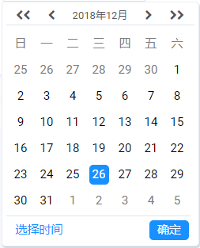

遗留问题

滚动选择时分时，如何将点击将选择项置顶

优化问题

同一页面多个组件使用时，点击其中一个隐藏另外一个已展开面板

现有方法:

 使用e.nativeEvent.stopImmediatePropagation();将组建内所有点击事件禁止冒泡到document

 在togglePanel函数(打开关闭面板)中利用class 获取全部打开面板，

 使用setAttribute更改class,使面板全部关闭
 
```
togglePanel(e) {
    e.nativeEvent.stopImmediatePropagation();
    let doms = document.getElementsByClassName('panelOption');
    for (let i = 0; i < doms.length; i++) {
      doms[i].setAttribute('class', 'hideDom');
    }
    this.props.config.data = this.getResult();
    this.setState({
      showPanel: !this.state.showPanel,
      status: this.format.includes('YYYY') ? 'date' : 'time',
    });
}
//点击选择面板之外的地方，关闭面板
  closePanel(e) {
    this.props.config.data = this.getResult();
    this.setState({
      showPanel: false,
    });
  }
  componentDidMount() {
    document.addEventListener('click', this.closePanel, false);
  }
```
是否有其他方案

已优化

利用findDOMNode找到组件的DOM node,使用contains判断e.target是否是当前组件子元素,如果不是则关闭面板
```
import { findDOMNode } from 'react-dom';
  togglePanel() {
    this.props.config.data = this.getResult();
    this.setState({
      showPanel: !this.state.showPanel,
      status: this.format.includes('YYYY') ? 'date' : 'time',
    });
  }

  //点击选择面板之外的地方，关闭面板
  closePanel(e) {
    if (!findDOMNode(this.refs.dateTime).contains(e.target)) {
      this.props.config.data = this.getResult();
      this.setState({
        showPanel: false,
      });
    }
  }
  componentDidMount() {
    document.addEventListener('click', this.closePanel, false);
  }
 render() {
    return (<div className="dateTime" ref="dateTime">
    ...
    </div>
    )}
```


各种选择界面





